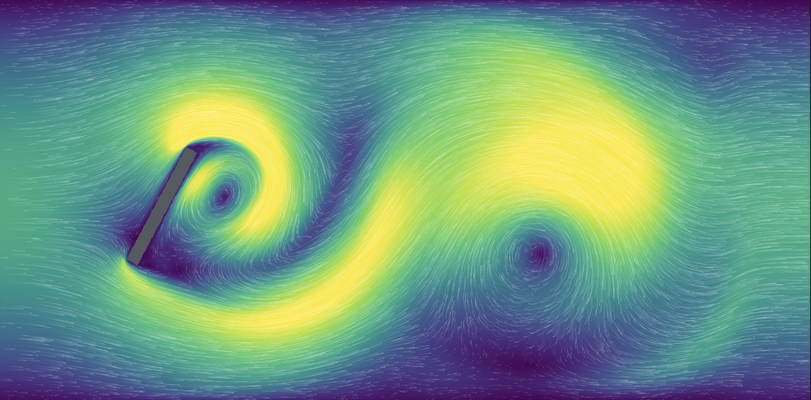

# Lattice Boltzmann wind tunnel

A wind tunnel in the browser: lattice Boltzmann with TRT collision, running as WebGPU compute shaders.

- **2D** (D2Q9, `index.html`) implements the recommendations in [docs/research/lattice-boltzmann-browser-wind-tunnel.md](docs/research/lattice-boltzmann-browser-wind-tunnel.md).
- **3D** (D3Q19, `3d.html`) follows [docs/research/3d-lattice-boltzmann-webgpu.md](docs/research/3d-lattice-boltzmann-webgpu.md) and the [3D spec](docs/dietpowers/2026-09-27-3d-tunnel-spec.md).



**Live demo: https://slowernet.github.io/cells/** (2D) and [3d.html](https://slowernet.github.io/cells/3d.html) (3D). It also serves the [validation suite](https://slowernet.github.io/cells/validate.html) and the [MLUPS benchmark](https://slowernet.github.io/cells/bench.html). Every push to `main` deploys the demo to GitHub Pages (`.github/workflows/pages.yml`).

```sh
npm install
npm run dev          # http://localhost:5173 — 2D tunnel, /3d.html, /validate.html, /bench.html
npm test             # unit tests (vitest)
npm run test:gpu     # headless Chrome (WebGPU): validation cases, 2D benchmark, 3D page smoke test
npm run bench        # MLUPS benchmark in headless Chrome
tail -f test-results/progress.log   # follow a running GPU test or benchmark
```

Needs a browser with WebGPU: Chrome/Edge 113+, Safari 26, or Firefox on Windows or Apple Silicon. The 3D tunnel stores distributions in FP16 when the device has the `shader-f16` feature, and falls back to FP32 otherwise.

## What it does: 2D

- **Solver** (`src/shaders/step.ts`): one fused pull-stream, boundary and collide kernel per time step. All steps for a frame go into one compute pass. Distributions are stored structure-of-arrays as `f_i − w_i`, which keeps float32 precision for small deviations from rest.
- **Collision**: TRT with Λ = 3/16, plus an optional Smagorinsky subgrid model in closed form from the non-equilibrium momentum flux. τ is clamped at 0.51.
- **Boundaries**:
  - Zou-He velocity inlet, ramped over 3000 steps, and a Zou-He pressure outlet (ρ = 1).
  - Absorbing layers: a viscosity sponge plus relaxation toward the inflow state over the last 15% of the domain. The solver also supports a thin layer after the inlet (`inletLayerFraction`), which only the NACA validation case uses.
  - Walls can be slip, no-slip, moving or periodic.
- **Obstacles**: stored as a signed distance field. Bouzidi interpolated bounce-back uses link fractions derived from the SDF. Drawn shapes are unions of discs, so they get the same curved-wall treatment.
- **Forces**: computed by momentum exchange inside the step kernel and summed on the GPU. They are shown as C_D and C_L traces, and the Strouhal number comes from zero crossings of C_L.
- **Visualization**: vorticity, speed, density and Schlieren views, computed in the fragment shader from the macro buffer. GPU tracer particles are drawn as line segments into fading trail textures, in wind or streakline mode.

## What it does: 3D

- **Solver** (`src/shaders/step3d.ts`): a D3Q19 version of the same fused kernel, with TRT (Λ = 3/16), optional Smagorinsky, and τ clamped at 0.51.
  - Distributions are stored as `f_i − w_i`. FP16 storage is scaled by 2^15 and roughly doubles throughput; FP32 is the reference.
  - Grids are 128×64×64, 192×96×96 (the default) and 256×128×128. A grid is offered only if its buffers fit the device's limits.
- **Boundaries**:
  - The inlet plane is set to the equilibrium at the ramped inflow speed.
  - The outlet plane copies the missing populations from the plane behind it, then relaxes to the equilibrium at ρ = 1.
  - The same outlet sponge and absorbing layer as 2D.
  - Slip walls on the four sides. Where a spanwise body meets a side face, the wall bounces back.
- **Obstacles**: a sphere, a cube, a spanwise cylinder or a NACA0012 wing, as a signed distance field with Bouzidi walls and momentum-exchange forces. Changing the obstacle swaps it in without restarting the flow.
- **Visualization**:
  - an orbit camera;
  - the obstacle, sphere-traced through its SDF;
  - one slice plane on any axis, showing speed or vorticity magnitude;
  - 16,384 tracers released from a rake near the inlet.
- **Throughput on an Apple M5**, medium grid: about 1,300 MLUPS with FP16 and 700 with FP32 (`npm run bench`). The page runs about 600 lattice steps per second at defaults.

## Validation

`/validate.html` (or `npm run test:gpu`) runs the validation suite. Each metric prints the published range and the acceptance range the solver has to meet.

- **2D**, the benchmark suite from the research doc: Poiseuille, Taylor-Green, Schäfer-Turek 2D-1 and 2D-2, the unconfined cylinder at Re 100, the Ghia cavity at Re 1000 and NACA0012 at Re 500. A periodic-seam check confirms that forces don't change when a body straddles a periodic boundary.
- **3D**: `sphereFp16` runs a sphere at Re 100 in FP32 and FP16 and requires FP16's C_D to be within 1% of FP32's. It reports C_D against the published value without gating it, because the sphere sits close to the inlet. It is skipped on devices without `shader-f16`.

## Acknowledgement

Claude Opus 5.5 (Anthropic) researched and implemented this project, working in Claude Code under the direction of [@slowernet](https://github.com/slowernet). The research docs, both solvers, the validation suite, the benchmark, the demo and this README all came out of those sessions. The 2D implementation session cost about $11.61 in API usage. Two subagent runs, a reference check and an adversarial code review, account for roughly 200,000 of its tokens. The 2D research doc was written in an earlier session, and the 3D mode in later ones; neither cost is included in that figure.
